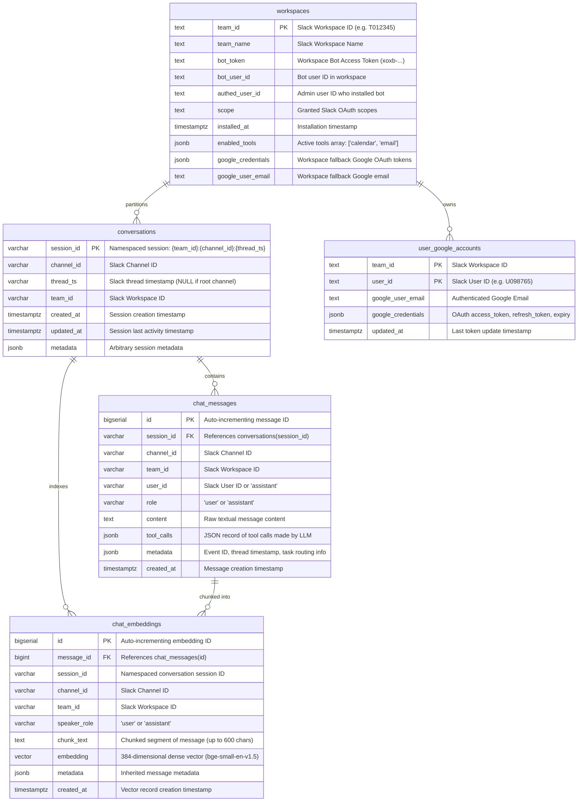
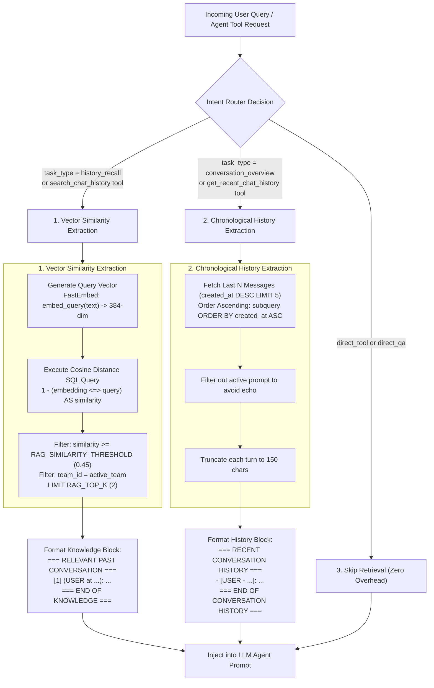
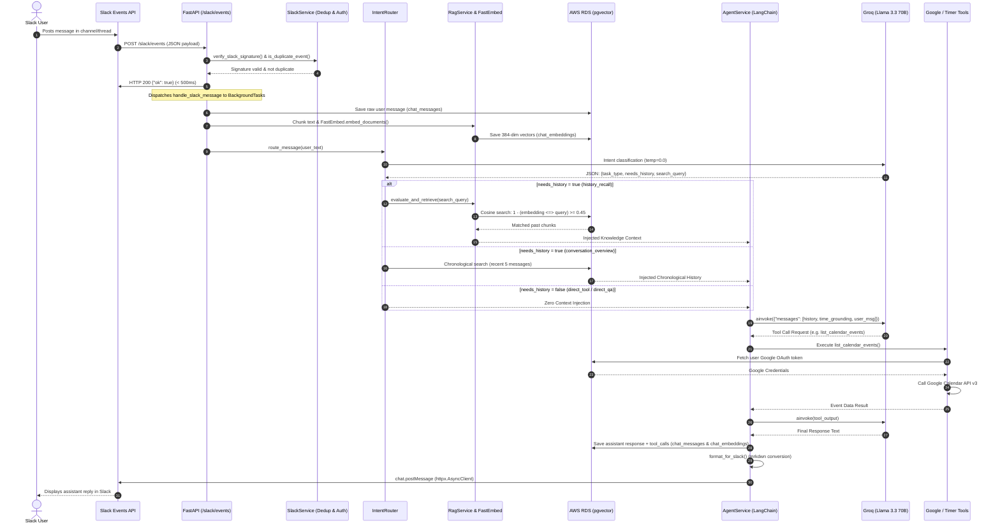
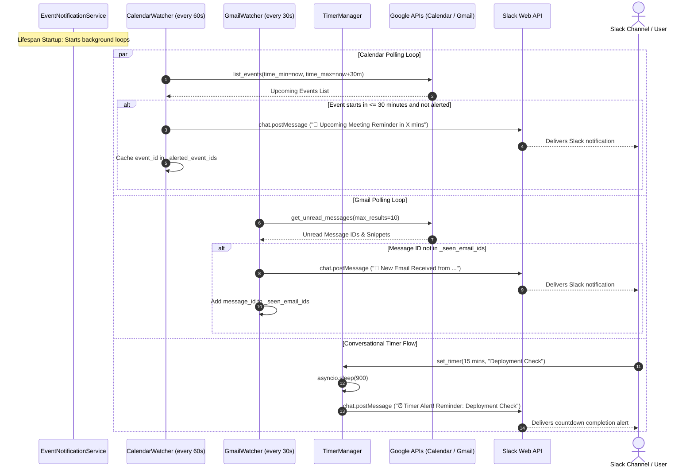

# Architecture & System Design — SlackOps AI

This document details the complete end-to-end architecture of **SlackOps AI**: how components interact, what is connected to what, all data structures stored in PostgreSQL with `pgvector`, and exactly how data is extracted and queried.

---

## 1. Master System Architecture Diagram

```mermaid
flowchart TB
    %% External Actors & Clients
    subgraph Clients ["External Actors & Ingress"]
        SlackUser["Slack User / Channel / DM"]
        BrowserUser["Browser User / Admin Dashboard"]
    end

    %% Cloud & Ingress Boundary
    subgraph Ingress ["Ingress & Web Server (FastAPI)"]
        FastAPI["FastAPI Application (Port 8000)"]
        EventsEndpoint["POST /slack/events<br/>(Slack Events API Webhook)"]
        OAuthEndpoint["GET /slack/install<br/>GET /slack/oauth/callback"]
        GoogleOAuthEndpoint["GET /auth/google/start<br/>GET /auth/google/callback"]
        ApiMeEndpoint["GET/POST /api/me/*<br/>(Dashboard & Live Test Chat)"]
        HealthEndpoint["GET /health & GET /db-test"]
        StaticServer["GET / (Static Dashboard UI)"]
    end

    %% Security & Context
    subgraph Security ["Security & Context Resolution"]
        SlackSigCheck["Slack HMAC-SHA256 Signature Verification<br/>(SLACK_SIGNING_SECRET)"]
        DedupEngine["Event Deduplication Engine<br/>(OrderedDict LRU Cache)"]
        SessionCrypto["Session Cookie Auth<br/>(HMAC-SHA256 Signed Tokens)"]
        ContextBinding["ContextVar Request Scoper<br/>current_user_context: (team_id, user_id)"]
    end

    %% Routing & Orchestration
    subgraph Orchestration ["Orchestration & Decision Layer"]
        BackgroundQueue["FastAPI BackgroundTasks Queue"]
        SlackService["SlackService<br/>(Async Client, Auto-Join Channel)"]
        IntentRouter["Adaptive Intent Router<br/>(Groq 0.0 Temp + Regex Heuristics)"]
        AgentService["AgentService<br/>(LangChain Agent Orchestrator)"]
        PromptAssembler["Prompt & Temporal Grounder<br/>([Current System Time] + Context)"]
        OutputSanitizer["Output Sanitizer<br/>(format_for_slack: Markdown to mrkdwn)"]
    end

    %% Intelligence & External LLM
    subgraph LLM ["Inference Provider"]
        GroqAPI["Groq Cloud API<br/>(llama-3.3-70b-versatile)"]
    end

    %% Memory & Vector Engine
    subgraph VectorEngine ["RAG & Embedding Pipeline"]
        RagService["RagService (Coordinator)"]
        TextChunker["Text Chunker<br/>(600 chars, 80 char overlap)"]
        FastEmbed["FastEmbed (ONNX Runtime)<br/>(BAAI/bge-small-en-v1.5 / 384-dim)"]
        VectorStore["VectorStore Service<br/>(asyncpg abstraction)"]
    end

    %% Persistence Layer
    subgraph Database ["Persistence: AWS RDS PostgreSQL + pgvector"]
        DbPool["Async Connection Pool (asyncpg + SSL require)"]
        T_Workspaces[("workspaces<br/>(Multi-Tenant Slack Installs)")]
        T_UserGoogle[("user_google_accounts<br/>(Per-User OAuth Tokens)")]
        T_Conversations[("conversations<br/>(Sessions & Threads)")]
        T_ChatMessages[("chat_messages<br/>(Raw User/Assistant Turns)")]
        T_ChatEmbeddings[("chat_embeddings<br/>(384-dim Vectors + HNSW Index)")]
    end

    %% Tool Execution Suite
    subgraph Tools ["LangChain Execution Tools"]
        CalTools["Calendar Tools<br/>(list, create, search)"]
        GmailTools["Gmail Tools<br/>(search, unread, read, send)"]
        RagTools["Memory Tools<br/>(search_chat_history, get_recent)"]
        TimerTools["Timer Tools<br/>(set_timer, list, cancel)"]
    end

    %% External SaaS Services
    subgraph ExternalSaaS ["External Workspace APIs"]
        GoogleCalAPI["Google Calendar API v3"]
        GoogleMailAPI["Google Gmail API v1"]
        GoogleOAuthAPI["Google OAuth2 & UserInfo API"]
        SlackWebAPI["Slack Web API<br/>(chat.postMessage, conversations.join)"]
    end

    %% Background Daemons
    subgraph ProactiveDaemons ["Event-Driven Proactive Notifications"]
        NotificationCoordinator["EventNotificationService"]
        CalendarWatcher["CalendarWatcher<br/>(Polls every 60s, alerts <30m)"]
        GmailWatcher["GmailWatcher<br/>(Polls every 30s, alerts new unread)"]
        TimerManager["TimerManager<br/>(Async Sleep Countdown Worker)"]
    end

    %% Data Flow Connections
    SlackUser -->|Message / Mention| EventsEndpoint
    BrowserUser -->|Browser Session| StaticServer
    BrowserUser -->|OAuth Install| OAuthEndpoint
    BrowserUser -->|Connect Google| GoogleOAuthEndpoint
    BrowserUser -->|Configure Tools / Test Chat| ApiMeEndpoint

    EventsEndpoint --> SlackSigCheck
    SlackSigCheck --> DedupEngine
    DedupEngine --> BackgroundQueue
    BackgroundQueue --> SlackService
    BackgroundQueue --> ContextBinding

    ApiMeEndpoint --> SessionCrypto
    SessionCrypto --> ContextBinding
    ContextBinding --> AgentService

    SlackService -->|conversations.join| SlackWebAPI
    SlackService --> AgentService

    AgentService -->|1. Store Raw User Message| RagService
    RagService -->|Text Chunks| TextChunker
    TextChunker -->|Compute Vectors| FastEmbed
    FastEmbed -->|Vector Embeddings| VectorStore
    VectorStore --> DbPool
    DbPool --> T_Conversations
    DbPool --> T_ChatMessages
    DbPool --> T_ChatEmbeddings

    AgentService -->|2. Classify Intent| IntentRouter
    IntentRouter -->|Classify Prompt| GroqAPI
    IntentRouter -->|Needs Memory?| RagService

    RagService -->|Search Similar Chunks| VectorStore
    VectorStore -->|HNSW Cosine Query| T_ChatEmbeddings
    VectorStore -->|Chronological Fetch| T_ChatMessages

    AgentService -->|3. Assemble Prompt & Context| PromptAssembler
    PromptAssembler -->|Messages Payload| AgentService
    AgentService -->|Execute Agent Loop| GroqAPI
    AgentService -->|Invoke Registered Tools| Tools

    CalTools -->|OAuth Context| GoogleCalAPI
    GmailTools -->|OAuth Context| GoogleMailAPI
    RagTools -->|On-demand Retrieval| RagService
    TimerTools -->|Schedule Alert| TimerManager

    AgentService -->|4. Store Assistant Turn| RagService
    AgentService -->|5. Sanitize mrkdwn| OutputSanitizer
    OutputSanitizer -->|chat.postMessage| SlackService
    SlackService -->|API Request| SlackWebAPI
    SlackWebAPI -->|Deliver Reply| SlackUser

    %% OAuth Storage
    OAuthEndpoint -->|Exchange Code| SlackWebAPI
    OAuthEndpoint -->|Store Token| T_Workspaces
    GoogleOAuthEndpoint -->|Exchange Code| GoogleOAuthAPI
    GoogleOAuthEndpoint -->|Store Per-User Creds| T_UserGoogle
    GoogleOAuthEndpoint -->|Store Workspace Creds| T_Workspaces

    %% Proactive Alerts
    NotificationCoordinator --> CalendarWatcher
    NotificationCoordinator --> GmailWatcher
    NotificationCoordinator --> TimerManager
    CalendarWatcher -->|Check Events| GoogleCalAPI
    GmailWatcher -->|Check Unread| GoogleMailAPI
    CalendarWatcher -->|Post Proactive Alert| SlackService
    GmailWatcher -->|Post Proactive Alert| SlackService
    TimerManager -->|Post Timer Expiry| SlackService
```



---

## 2. Component Interconnectivity Map ("What is Connected to What")

| Source Component | Target Component | Protocol / Mechanism | Data Passed / Purpose |
| :--- | :--- | :--- | :--- |
| **Slack Platform** | `POST /slack/events` | HTTPS Webhook | JSON payload containing user message, thread timestamp, channel ID, team ID, and Slack signatures (`X-Slack-Signature`). |
| `POST /slack/events` | `SlackService.verify_slack_signature` | In-memory HMAC-SHA256 | Validates request authenticity using `SLACK_SIGNING_SECRET` and rejects replay attacks older than 5 minutes. |
| `POST /slack/events` | `SlackService.is_duplicate_event` | In-memory LRU cache | Discards duplicate `event_id` deliveries caused by Slack delivery retries. |
| `POST /slack/events` | `WorkspaceRepository.get_workspace` | PostgreSQL Query / Local Cache | Resolves workspace-specific bot token and enabled tools using `team_id`. |
| `POST /slack/events` | `FastAPI BackgroundTasks` | Async Background Task | Defers `handle_slack_message` so `/slack/events` can return HTTP 200 within Slack's strict 3-second threshold. |
| `handle_slack_message` | `SlackService.join_channel_async` | HTTP POST (`conversations.join`) | Ensures the bot joins public channels automatically before replying. |
| `handle_slack_message` | `current_user_context` (`ContextVar`) | Python `contextvars` | Binds `(team_id, user_id)` for the lifecycle of the request so tools operate strictly within the caller's identity. |
| `handle_slack_message` | `AgentService.process_message` | Async invocation | Starts end-to-end RAG ingestion, intent classification, LLM reasoning, and response generation. |
| `AgentService` | `RagService.store_user_turn` | Async call | Stores incoming message turn into `chat_messages` and chunked vectors into `chat_embeddings`. |
| `AgentService` | `IntentRouter.route_message` | HTTP POST to Groq | Classifies user intent into 1 of 5 routing types to determine if database recall is needed. |
| `AgentService` | `RagService.evaluate_and_retrieve` | In-memory / Vector search | If retrieval is required, fetches relevant conversation snippets from PostgreSQL. |
| `AgentService` | `AgentService.get_agent` | LangChain Factory | Instantiates or retrieves cached `ChatGroq` agent loaded with workspace-enabled tools. |
| `AgentService` | `Groq Cloud API` | HTTPS REST | Invokes `llama-3.3-70b-versatile` with system prompt, temporal grounding, past context, and tool definitions. |
| `AgentService` | Tool Execution Suite | Tool Dispatch | Agent calls `CalendarTools`, `GmailTools`, `RagTools`, or `TimerTools` when triggered by LLM tool calls. |
| `Google Tools` | `get_google_credentials` | In-memory resolution | Retrieves refreshed OAuth2 credentials matching the active `(team_id, user_id)` from `user_google_accounts`. |
| `Google Tools` | Google Calendar / Gmail APIs | HTTPS Google Client | Performs calendar bookings, event listing, email reading, search, and email dispatch. |
| `Timer Tools` | `TimerManager.set_timer` | Async Task / Thread | Registers countdown timer and spawns async task awaiting completion. |
| `AgentService` | `RagService.store_assistant_turn` | Async call | Persists bot response and tool call records to `chat_messages` and `chat_embeddings`. |
| `AgentService` | `format_for_slack` | Regex sanitization | Converts standard markdown headers and bolding into Slack mrkdwn (`*bold*`, `code`, bullet points). |
| `AgentService` | `SlackService.send_message_async` | HTTP POST (`chat.postMessage`) | Sends formatted response to Slack channel or thread using pooled `httpx.AsyncClient`. |
| `CalendarWatcher` (Daemon) | Google Calendar API | Polling (every 60s) | Detects meetings starting in `< 30 minutes` and posts alerts via `SlackService`. |
| `GmailWatcher` (Daemon) | Gmail API | Polling (every 30s) | Detects new unread emails in inbox and posts preview notifications via `SlackService`. |
| `TimerManager` (Daemon) | `SlackService.post_proactive_alert`| Event Callback | Fires proactive alert into the channel when countdown timer reaches zero. |

---

## 3. Database Architecture ("What Data We Store in DB")

The database is **AWS RDS PostgreSQL (15+)** with the **`pgvector`** extension. All operations are non-blocking via `asyncpg` connection pooling with SSL encryption (`sslmode=require`).



### Table Details & Storage Specifications

#### 1. `workspaces`
* **Purpose**: Manages multi-tenant Slack workspace installations, individual workspace bot tokens, tool permissioning, and workspace-level fallback credentials.
* **Key Columns**:
  - `team_id` (`TEXT PRIMARY KEY`): Unique Slack Team identifier (e.g., `T09ABCDEF`).
  - `team_name` (`TEXT`): Human-readable workspace name.
  - `bot_token` (`TEXT`): Bot token (`xoxb-...`) used for all API requests to that specific workspace.
  - `bot_user_id` (`TEXT`): Bot user ID to distinguish self-messages and avoid loops.
  - `enabled_tools` (`JSONB`): Active tools array (default `["calendar", "email"]`).
  - `google_credentials` (`JSONB`): Optional workspace-wide shared Google OAuth credentials.

#### 2. `user_google_accounts`
* **Purpose**: Strict per-user isolation of Google OAuth credentials. Each Slack user in each workspace authenticates their own personal Google Calendar and Gmail.
* **Key Columns**:
  - `team_id` (`TEXT`): Part 1 of Composite Primary Key.
  - `user_id` (`TEXT`): Part 2 of Composite Primary Key (Slack User ID).
  - `google_user_email` (`TEXT`): Connected Google email address.
  - `google_credentials` (`JSONB`): OAuth token structure containing `access_token`, `refresh_token`, `token_uri`, `client_id`, `client_secret`, and `scopes`.
  - `updated_at` (`TIMESTAMPTZ`): Timestamp of last token refresh/link.

#### 3. `conversations`
* **Purpose**: Tracks active conversational threads and channel sessions.
* **Key Columns**:
  - `session_id` (`VARCHAR(255) PRIMARY KEY`): Format `{team_id}:{channel_id}:{thread_ts}` (or `{team_id}:{channel_id}:main`).
  - `channel_id` (`VARCHAR(100)`): Channel where conversation occurred.
  - `thread_ts` (`VARCHAR(100)`): Thread timestamp if message is in a Slack thread.
  - `team_id` (`VARCHAR(100)`): Multi-tenant workspace identifier.
  - `metadata` (`JSONB`): Dynamic properties associated with the session.

#### 4. `chat_messages`
* **Purpose**: Complete audit log and conversational history of raw user inputs and model replies.
* **Key Columns**:
  - `id` (`BIGSERIAL PRIMARY KEY`): Unique message ID.
  - `session_id` (`VARCHAR(255)`): Foreign key referencing `conversations.session_id` (`ON DELETE CASCADE`).
  - `team_id` (`VARCHAR(100)`): Workspace partition key.
  - `user_id` (`VARCHAR(100)`): Slack user ID or `'assistant'`.
  - `role` (`VARCHAR(50)`): `'user'` or `'assistant'`.
  - `content` (`TEXT`): The exact text of the message.
  - `tool_calls` (`JSONB`): Execution log of tool invocations (names, arguments, results).
  - `metadata` (`JSONB`): Metadata such as `event_id`, `task_type`, and `rag_used`.

#### 5. `chat_embeddings`
* **Purpose**: High-dimensional vector store for semantic retrieval and long-term memory RAG.
* **Key Columns**:
  - `id` (`BIGSERIAL PRIMARY KEY`): Unique chunk vector ID.
  - `message_id` (`BIGINT`): Foreign key referencing `chat_messages.id` (`ON DELETE CASCADE`).
  - `team_id` (`VARCHAR(100)`): Workspace partition key preventing cross-tenant leakage.
  - `chunk_text` (`TEXT`): Semantic slice (up to 600 characters).
  - `embedding` (`vector(384)`): 384-dimensional dense vector produced by FastEmbed (`BAAI/bge-small-en-v1.5`).

### Database Indexes

| Index Name | Table | Type | Target Columns / Operator | Purpose |
| :--- | :--- | :--- | :--- | :--- |
| `idx_chat_embeddings_hnsw` | `chat_embeddings` | **HNSW** | `embedding vector_cosine_ops` | Sub-millisecond approximate nearest neighbor cosine similarity search across millions of vectors. |
| `idx_conversations_channel` | `conversations` | B-tree | `(channel_id)` | Fast lookup of channel sessions. |
| `idx_conversations_team` | `conversations` | B-tree | `(team_id)` | Fast multi-tenant session filtering. |
| `idx_chat_messages_session` | `chat_messages` | B-tree | `(session_id, created_at ASC)` | Sequential conversation turn retrieval for short-term memory. |
| `idx_chat_messages_channel` | `chat_messages` | B-tree | `(channel_id, created_at ASC)` | Channel-wide message retrieval. |
| `idx_chat_messages_team` | `chat_messages` | B-tree | `(team_id)` | Workspace isolation enforcement. |
| `idx_chat_embeddings_channel` | `chat_embeddings` | B-tree | `(channel_id)` | Channel-scoped vector filtering. |
| `idx_chat_embeddings_session` | `chat_embeddings` | B-tree | `(session_id)` | Session-scoped vector filtering. |
| `idx_chat_embeddings_team` | `chat_embeddings` | B-tree | `(team_id)` | Tenant-scoped vector filtering. |
| `idx_workspaces_installed_at` | `workspaces` | B-tree | `(installed_at DESC)` | Recent workspace install enumeration. |
| `idx_user_google_accounts_lookup`| `user_google_accounts`| B-tree | `(team_id, user_id)` | Fast OAuth credential resolution per request. |

---

## 4. Data Extraction Pipeline ("How We Extract Data")

Data extraction from PostgreSQL follows distinct patterns depending on whether the query needs **semantic similarity**, **chronological history**, **user credentials**, or **diagnostics**.



### Extraction Query Catalog

#### 1. Semantic Similarity Search (pgvector Cosine Distance)
Executed by `VectorStore.search_similar_chunks` during `history_recall` or `search_chat_history`:
```sql
SELECT 
    id,
    message_id,
    session_id,
    channel_id,
    speaker_role,
    chunk_text,
    metadata,
    created_at,
    1 - (embedding <=> $1) AS similarity
FROM chat_embeddings
WHERE ($2::varchar IS NULL OR channel_id = $2)
  AND ($5::varchar IS NULL OR team_id = $5)
  AND (1 - (embedding <=> $1)) >= $3
ORDER BY embedding <=> $1 ASC
LIMIT $4;
```
* **Parameters**:
  - `$1`: Dense float vector array (`np.array(query_embedding, dtype=np.float32)`).
  - `$2`: Target `channel_id` (or `NULL` to recall cross-channel knowledge within the workspace).
  - `$3`: Cosine similarity threshold (defaults to `settings.RAG_SIMILARITY_THRESHOLD = 0.45`).
  - `$4`: Top K limit (defaults to `settings.RAG_TOP_K = 2`).
  - `$5`: Tenant `team_id` enforcing workspace isolation.
* **Operator**: `<=>` is pgvector's cosine distance operator. Cosine similarity is calculated as `1 - (embedding <=> query)`.

#### 2. Chronological Recent Turns (Short-Term Conversational Memory)
Executed by `VectorStore.get_recent_messages` during `conversation_overview` or `get_recent_chat_history`:
```sql
SELECT id, session_id, channel_id, user_id, role, content, created_at
FROM (
    SELECT id, session_id, channel_id, user_id, role, content, created_at
    FROM chat_messages
    WHERE ($1::varchar IS NULL OR session_id = $1)
      AND ($2::varchar IS NULL OR channel_id = $2)
    ORDER BY created_at DESC
    LIMIT $3
) sub
ORDER BY created_at ASC;
```
* **Parameters**:
  - `$1`: Target `session_id` (`{team_id}:{channel_id}:{thread_ts}`).
  - `$2`: Target `channel_id`.
  - `$3`: Maximum messages to retrieve (`SHORT_TERM_MEMORY_LIMIT = 4`).
* **Design Note**: A nested subquery retrieves the latest turns in descending order, and the outer query sorts them ascending so the LLM receives messages in natural chronological sequence.

#### 3. Per-User Google OAuth Credential Extraction
Executed by `UserGoogleRepository.get_user_google_account`:
```sql
SELECT team_id, user_id, google_user_email, google_credentials, updated_at
FROM user_google_accounts
WHERE team_id = $1 AND user_id = $2;
```
* **Parameters**:
  - `$1`: Active Slack Workspace ID (`team_id`).
  - `$2`: Active Slack Calling User ID (`user_id`).
* **Fallback Strategy**: If not found in `user_google_accounts`, the system falls back to `workspaces.google_credentials` for the workspace.

#### 4. Multi-Tenant Workspace & Bot Token Extraction
Executed by `WorkspaceRepository.get_workspace`:
```sql
SELECT team_id, team_name, bot_token, bot_user_id, authed_user_id,
       scope, installed_at, enabled_tools, google_credentials, google_user_email
FROM workspaces
WHERE team_id = $1;
```
* **Performance Optimization**: Successfully retrieved records are cached in an in-memory dictionary (`self._cache[team_id]`) to prevent repetitive database I/O on every incoming webhook event.

#### 5. Deep Health & Diagnostic Extraction
Executed by `/db-test` and `/health`:
```sql
SELECT version();
SELECT extversion FROM pg_extension WHERE extname = 'vector';
SELECT COUNT(*) FROM chat_messages;
SELECT COUNT(*) FROM workspaces;
```
* Measures PostgreSQL engine version, verifies that `pgvector` is registered and active, measures query latency in milliseconds, and counts stored messages and workspaces.

---

## 5. End-to-End Execution Lifecycles

### A. Webhook Ingress to Slack Response Sequence



### B. Proactive Background Notifications Lifecycle



---

## 6. Summary of Key Architectural Decisions

1. **pgvector HNSW Indexing**: Uses Hierarchical Navigable Small World (`hnsw (embedding vector_cosine_ops)`) instead of IVFFlat to allow high-recall, zero-maintenance indexing without requiring a training step or rebuilding on small datasets.
2. **Deterministic Intent Routing**: Employs Groq LLM with `temperature=0.0` and strict JSON schemas, backed by compiled regex heuristics, preventing prompt bloating when queries do not require past context.
3. **CPU-Native Embeddings**: Uses FastEmbed (`BAAI/bge-small-en-v1.5`) running locally via ONNX Runtime to avoid external embedding API network hops and eliminate embedding API costs.
4. **Strict Multi-Tenant Isolation**: Every conversation turn, vector embedding, and OAuth token is partitioned by `team_id` and `(team_id, user_id)`, ensuring enterprise data confidentiality across workspaces.
5. **Resilient Non-Blocking Ingress**: Immediate HTTP 200 acknowledgement to Slack Events API with background async processing avoids Slack event retry storms and duplicate responses.
